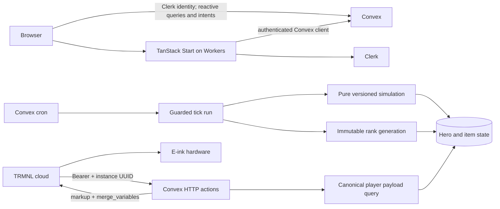

# Backend and application architecture

## Service responsibilities

| Service | Owns |
| --- | --- |
| Convex | Database, authorized queries/mutations, pure simulation invocation, scheduling, leaderboard generations, direct TRMNL lifecycle/render HTTP endpoints |
| Cloudflare Workers | TanStack Start SSR/web routes, static assets, authenticated installation/management UI, protected server functions |
| Clerk | Companion user authentication; Convex validates Clerk-issued identity |
| TRMNL cloud | Marketplace installation, periodic screen requests, Liquid/framework rendering and delivery to the hardware |
| Resend | Available existing service; no MVP gameplay email dependency. Reuse later for explicitly requested transactional email |

No additional database, queue, cache service, Durable Object, Worker cron or Discord service is required for MVP. Convex is the source of truth. It verifies the one-time saved-installation activation gate; gameplay mutations and scheduled adapters enforce persisted activation. After activation, device sleep/offline/disconnection is independent of game progression. No hardware-ownership lookup or extra service is needed.

Cloudflare documents a current Vite-based TanStack Start integration with Workers. Use that path and verify the exact SDK/runtime combination; do not use the legacy Vinxi snippets from the local Clerk skill as scaffolding instructions. [Cloudflare guide](https://developers.cloudflare.com/workers/framework-guides/web-apps/tanstack-start/)

## Data flow



The browser may call Convex directly with a Clerk token for game interactions. SSR loaders/server functions create a **request-scoped** authenticated Convex client; never put a user's auth token in a shared singleton. A route guard improves UX; each backend function still authorizes every call. [Convex/Clerk integration](https://docs.convex.dev/auth/clerk)

## Planned repository layout

This is a target tree, not files to create during planning.

```text
convex/
  schema.ts                 current-release schema only
  auth.config.ts            Clerk issuer configuration
  crons.ts                  tick + watchdog + cleanup
  http.ts                   TRMNL lifecycle and screen routes
  users.ts, heroes.ts       identity/onboarding and hero reads
  inventory.ts              item intents
  trmnl.ts                  public install/management actions and lifecycle helpers
  trmnlPayload.ts           canonical internal query and JSON handler
  trmnlScreen.ts            screen adapter and packaged template response
  leaderboard.ts            frozen-input generation builder
  maintenance.ts            account deletion and retention batches
  admin.ts                  health and guarded recovery
  lib/                      ownership, invariants, operation receipts, rate limits
  sim/                      run orchestration and pure versioned core
  content/                  versioned biomes/monsters/items/constants
  templates/                compiled static Liquid strings for four layouts
src/
  routes/                   TanStack file routes
  components/               hero, log, inventory, leaderboard, connections
  lib/                      auth/Convex integration and request-scoped helpers
  styles/
public/sprites/             small versioned monochrome PNG assets
trmnl/                     source Liquid files and screenshot cases
tests/                     transaction, contract and end-to-end tests
tools/                     deterministic balance and capacity harnesses
docs/                      this plan + implementation evidence
.github/workflows/         proposed coordinated GitHub Actions CI/CD
```

Use one pnpm project initially, not a multi-package monorepo. The pure domain types may live under `convex/sim` with type-only adapters for Convex documents. Avoid importing server modules into browser bundles.

## Pure core boundary

Inputs: validated hero domain state, ordered inventory, immutable content catalog, logical tick ID, per-hero seed, and no runtime context.

Outputs follow [domain contracts](domain-contracts.md): allowlisted next hero state, bounded item directives, optional event, metrics and disposition. The adapter creates rank projections; the pure core has no user identity or leaderboard copies. The database adapter allocates IDs and commits everything in one mutation. The core never imports Convex context, fetch, time, storage or auth.

Not all hero fields are owned by the simulation: names, ownership, auth, connection records, name-repair/version and deletion flags must not be overwritten by a stale core patch. Use an explicit allowlist for fields it can update. Current inventory/hero inputs are read in the same transaction that commits the result.

## Function kinds

- Public queries/mutations: authenticated companion reads and intents.
- Internal mutations: tick coordinator, page workers, rank builder, atomic publication, lifecycle state updates and cleanup.
- Actions: TRMNL code exchange, JWKS verification or other network calls; they call internal mutations after validation.
- HTTP actions: request parsing/authentication and output adaptation; call bounded internal queries/mutations.

Convex HTTP actions are exposed on the deployment's `.convex.site` domain and support prefix routes. Build explicit validated routes; do not use `path: '/trmnl/:token'` as if it were a parameterized Express route. [HTTP actions](https://docs.convex.dev/functions/http-actions)

## Architecture gates

1. Build/runtime/auth spike: prove Start/Vite/Clerk/Convex works on Workers and auth survives reload/SSR. Choose exact dependency versions only then and pin a lockfile.
2. TRMNL protocol spike: real install and screen generation; capture redacted shapes, response keys, UUID and multiple-instance semantics. No bare JSON payload in the screen-response route.
3. Scheduler/index spike: prove cohort pagination and immutable rank sorting under duplicate work and concurrent manual intents.

Spikes occur after coding is authorized and precede full implementation. Keep their proof artifacts and decisions in the docs.

## Forward evolution

Every run pins simulation and content versions. Templates have a release version independent of payload v1. New gameplay features can add optional payload fields; changes to existing fields require a versioned contract. Future schemas are separate design amendments rather than unused fields on every MVP document.

Planned extensions: new encounter resolvers, extra content catalogs, class-derived stats, additive player policy settings, additional board IDs, side-effect staging for social/guild systems, and separate contribution tables. Shared multiplayer rewards will require cross-hero transaction/idempotency design; they are not “free” additions to the pure core.

## Inventory, ranking and deletion boundaries

Inventory sleep/held gear belongs to deterministic game state, independent of hardware and browser visits. The adapter allocates held IDs, pure core resolves due wake, and commands only schedule future wake. Score projection receives pinned run effective time and one bounded history document; no clock/network inside pure functions.

One immutable publication holds both grouped recent views plus lifetime; query readers select only completed scoped generations. Convex owns durable account-deletion checkpoints; dedicated Clerk removal is an explicitly retried network step after local denial. Admin name repair increments public-name versions; stale copied names mask at read time. Only data used by approved MVP is added.
