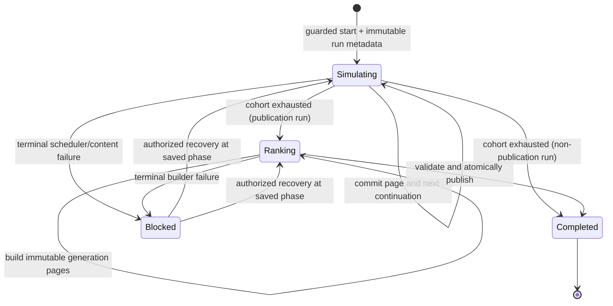

# Tick scheduling, transactions and recovery

One run per UTC hour publishes both grouped recent-XP views and lifetime as one complete set (D31); dormant heroes are skipped between publications (D32). Hardware/browser inactivity never affects progression. See [ranking](ranking.md), [inventory](inventory.md) and [leaderboards](leaderboards.md).

## Time semantics

Game ticks are monotonically increasing logical integers. Proposed cron: UTC minutes 13, 28, 43, 58. The world advances every 15 minutes when healthy, regardless of connected hardware or browser sessions.

There are three independent clocks: simulation schedule, TRMNL screen generation, and hardware wake/playlist display. Do not promise that offsetting the game cron guarantees fresh data immediately before a device refresh.

Store logical tick, wall-slot key and `scoreAt` (accepted scheduled UTC wall-slot timestamp, fixed for the run). All hero XP credits go to the hour bucket of `scoreAt`, and publication windows derive from it; recovery never changes it. Derive the wall-slot from the server's scheduled UTC quarter-hour, not a client timestamp. A duplicate coordinator invocation in one slot does not create a second logical tick. If the service misses wall slots, the next valid coordinator run advances once; it does not replay missed rewards.

An interrupted run resumes its same logical tick with the same seed/content/simulator versions. That is recovery, not catch-up. Eight-tick revival and travel timers depend on logical ticks, so downtime extends their wall-clock duration.

## Why internal mutations

All simulation work is database-only. Coordinator, page processing, continuation scheduling and publication use internal mutations. Scheduling from a mutation is atomic with its transaction. Scheduled mutations retry internal platform failures; programmer failures still require recovery. External OAuth/JWKS requests belong in actions and do not share these retry guarantees. [Convex scheduling](https://docs.convex.dev/scheduling/scheduled-functions)

A cron prevents overlap of its own invoked function, but not an entire fan-out chain after that function returns. Our `activeRunId` guard controls the complete chain. [Convex cron behavior](https://docs.convex.dev/scheduling/cron-jobs)

## Run state machine

`blocked` records the resumable phase/cursor; it does not discard already committed progress. Do not start a newer run while one is blocked. A single poisoned hero can be isolated; a broken orchestration/schema release pauses advancement visibly.

## Coordinator contract

`startTick` internal mutation:

1. Read singleton. If ticks paused/maintenance, record that the slot was intentionally skipped and return.
2. If an active run exists, return its identity without creating another run. Check watchdog separately.
3. If wall slot is already started or older than the last accepted slot, return no-op.
4. Increment logical tick once; insert the run with cohort cutoff, pinned content/simulation versions, effective `scoreAt`, `publishes` (last slot of its UTC hour, or `lastPublishedAt` more than 60 minutes old; D31), phase and sequence 0.
5. Set `activeRunId` and slot marker in the same transaction.
6. Schedule `simulateBatch({runId, expectedSequence:0})` in that transaction and persist the returned scheduled-function ID.

`world.currentTick` is the allocated tick, not a promise that every hero has finished it. `simulationRuns.finishedAt` means simulation finished and, on a publication run, board publication finished.

## Cohort and batching

Proposed initial page size: 25 heroes; tune only after byte/CPU measurements. Use an immutable server `createdAt` index restricted to `createdAt < cohortCutoff`. For same-millisecond creation, equality is excluded; those heroes join the next tick. First verified hero activation initializes `eligibleFromTick = world.currentTick + 1` and `lastTick = world.currentTick`. Pending creation is not eligibility; activation during an allocated run joins the following tick even if the hero's creation timestamp precedes its cutoff.

Paginate all cohort hero rows, then check current hero/owner state, persisted activation and `eligibleFromTick` per row. Skip pending/not-yet-eligible heroes before inventory reads, core evaluation and rank projection. On non-publication runs, also skip dormant heroes (paused, or sleeping with no wake scheduled) after the hero-row read, with no further reads or writes: their state cannot change without an intent, and an intent that resumes them schedules a future tick. Count them in `skippedDormant`. Do not paginate an index sorted by mutable HP, status, XP or level. New heroes cannot slip into the running cohort.

Each page worker:

1. Read run; verify active-run identity, phase and expected sequence. Stale duplicate worker returns no-op.
2. Load the next bounded cohort page using the stored cursor. Opaque cursors must not be reconstructed from IDs.
3. For each activated, tick-eligible current hero, read current owner state and its inventory (at most 32 item rows, or the narrower P23 read once measured). On publication runs also read its one bounded recent-XP history row. Recheck ownership and equipment invariants.
4. If eligible and `lastTick < run.tick`, invoke the pinned pure core with a deterministic per-hero seed.
5. Apply allowed hero fields, item changes, log and counters atomically. Set `lastTick` and progress fields.
6. Credit only this tick's earned XP once to the hero's current-hour accumulator. On publication runs, fold the accumulator into `heroScoreWindows`, expire at run `scoreAt`, and write one immutable `rankInputs` row for every eligible hero (dormant included for lifetime, with per-board recent flags). Never duplicate the run/hero projection.
7. Update run counters/cursor/sequence/progress time and schedule exactly one next worker in the same transaction.
8. If pagination is done, a publication run changes phase to ranking and schedules the generation builder; a non-publication run completes and clears `activeRunId` in the same transaction.

Avoid global singleton writes from every page; the run document holds progress and only coordinator/final publication change the singleton. One worker chain is deliberately simple for MVP. A sharded multi-worker design is a later capacity response, not speculative work.

No partial page rewards persist if the mutation fails. Checking `lastTick` protects a hero from duplicate evaluation, while the run sequence protects batch counters and continuation scheduling from duplicates. Both are required.

## Manual-intent concurrency

Companion intents and simulation may touch the same hero/items. Convex serializes committed state through transaction conflicts/retries. The tick consumes whichever valid state was committed before its evaluation; a later manual potion/equip affects the next state. There is no promise that a click exactly at a tick boundary happens first.

- A retry re-reads the hero and inventory. Do not hold stale action-read state and patch it later.
- Intents update only their fields; simulator patches only its owned fields.
- Operation receipts prevent a retried client command from applying twice.
- Level/XP changes are tick-authoritative; score expiry uses the pinned cutoff, so frozen rank inputs remain correct despite later gear/name/status commands. Inventory wake sets a future tick deadline and never causes same-allocated-tick rewards.
- Ordinary rename is deferred; restricted name repair increments a public-name version. Read-time masking of mismatched versions prevents old abusive copies resurfacing until the next generation. No name repair changes frozen scores/ranking tuples.

## Deterministic random generation

Proposed seed v1: SHA-256 of the UTF-8 JSON encoding of `[worldSeed, heroId, tick, simulationVersion, streamName]`, in that exact array order; take the first four digest bytes as an unsigned little-endian 32-bit seed. Use a versioned Mulberry32 integer PRNG, producing a uint32 divided by 2^32 for each uniform draw. Fixed stream names: `encounter`, `combat`, `reward`, `narrative`. Draw order (implemented in `convex/sim/core/simulate.ts`): `encounter` draws kind, then monster → elite roll for combat or the loot category for loot; `combat` draws per-round damage variance and trap avoid → damage; `reward` draws combat XP → gold → gear-drop chance → gear rarity → slot → template, or loot gold → jackpot, or gear rarity → slot → template; `narrative` only picks text. Every lucky check is consumed at a fixed position (D35). A pure JavaScript hashing implementation is needed inside the mutation/core adapter; verify runtime support before selecting its dependency.

The pure API receives the derived seed rather than deriving secrets itself. Fixed draw order, ordered inventory/template IDs, integer percentage rolls and fixed rounding are part of the simulation version. Never rely on array iteration over an unordered content collection.

Reproducible means identical **complete inputs** yield identical results. Seed + hero ID + tick alone cannot recreate a historical outcome if a manual action changed HP/equipment before evaluation. Retain redacted failure input snapshots and local scenario inputs for replay; do not retain every successful hero snapshot indefinitely.

Run metadata pins code/content versions. Deploys must retain supported versions for active runs or drain them before replacing the simulator. A version mismatch blocks visibly; never finish one run with mixed balance rules.

## Failure handling

### Pure hero input/content failure

Validate and execute the pure core before starting that hero's write set. Catch only recognized pure-core/invariant failures at this boundary. Mark the hero quarantined, store a bounded redacted input/failure record, append a service-pause log, and advance its evaluation marker without granting rewards. Expire recent-score history without credit and capture ranks for consistency; lifetime progression is unchanged. Already quarantined heroes stay unchanged and remain ranked until repaired/suspended.

Expose a service-pause label through the payload rather than silently pretending progression continues. Quarantine is operational, not an extra gameplay status. Repair and release are guarded admin operations; resuming grants no retroactive catch-up by default. Any compensation is a separately audited decision, never an automatic replay of partially understood state.

### Database/orchestration failure

Do not catch database failures after writes and continue. Let the page roll back. Inspect scheduled job status and resume the saved cursor/sequence after correcting the cause. No next tick while the failed run is active.

### Watchdog

Proposed every 5 minutes: inspect active run and its stored scheduled-function ID. Healthy processing target is under 2 minutes at the stated load. Alert after 5 minutes without progress.

- Pending/running job: do not schedule duplicate work blindly.
- Failed/cancelled/missing job with saved resumable phase: schedule a guarded continuation only for a recognized transient/recoverable condition.
- Deterministic developer/content failure: mark blocked, retain cursor, surface admin alert, stop endless retry.
- Persist recovery attempt count; at most 3 automated resumptions for one stuck sequence, then require diagnosis.

The worker still checks sequence/phase in case the watchdog raced a late success. Recovery never increments tick or changes seed.

## Completion and publication

When a publication run's cohort is exhausted, ranking uses frozen rank inputs from the same run. After validating all recent cohorts and lifetime, one mutation publishes the complete board-publication pointer, sets `lastPublishedAt`, marks the run completed and clears `activeRunId`. Failure before promotion leaves the previous complete board available.

The next scheduled wall slot starts the next tick. If processing crossed one or more slots, log the skipped slots; no immediate burst of compensating runs.

## Observability contract

Record logical tick, versions, phase, pages, hero counts by status (including inventory sleep), retained finds, window expiry/credit counters, encounter counts, deaths, level-ups, run duration and recovery attempts. Structured logs include run/phase/sequence and reason codes, not bearer tokens or private identity.

Health view shows allocated tick, last completed tick/time, board tick/time (normally under an hour old), current phase, quarantine count and cleanup lag. The device's stale indicator uses the last completed run plus unexpected hero evaluation lag, not response-generation time. Intentionally paused/sleeping/waiting-dead heroes are not stale merely because their last gameplay change is old, and dormant heroes are not stale because their evaluation marker stops between publications.

Activation is an adapter/lifecycle concern, outside the pure simulator. Never inspect live installation counts, sleep, polls or device connectivity per hero to determine progress. Once activated, disconnect/uninstall does not change simulation eligibility. Pending heroes emit no `rankInputs` and accumulate no catch-up for the wait before Save.
