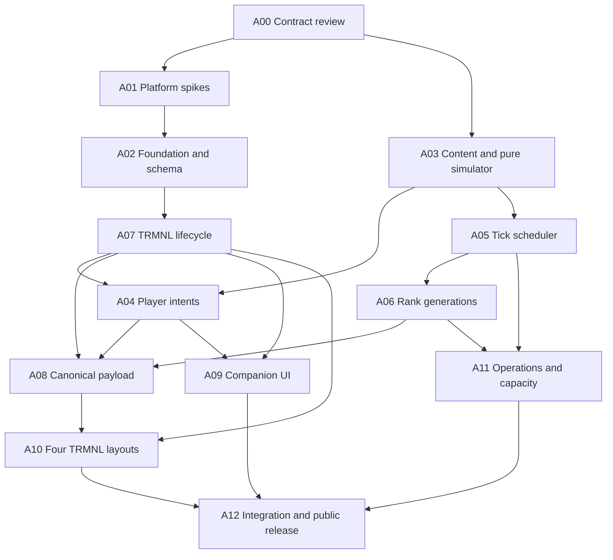

# Agent-ready implementation work packages

**Not started.** These packages prepare future assignment; Barry has authorized planning, not application coding or deployment. Confirm decisions and platform gates before activating implementation.

## Shared ownership and dependencies

One integration lead owns schema, HTTP/cron registrations, package/lockfiles, generated types, CI configuration and contract changes. Other agents propose changes through that owner. Give agents explicit branches/worktrees and narrow file ownership before parallel work.



Mock contracts permit early UI exploration, but production work cannot skip verified auth/protocol/data dependencies. IDs are milestones, not a requirement to use one agent per package.

## A00 — Review and freeze the brief

Owner: integration lead with Barry. Inputs: all docs, especially [decisions](decisions.md). Outputs: confirmed six defaults, launch-configuration questions, spike checklist and coding authorization. Files: docs only.

Done when confirmed choices, MVP/future boundaries and unresolved gates are recorded. Domain/account/repo selection can wait until those resources are needed. Do not assign speculative Month 2 features as MVP work.

D24–D28 and [build refinements](build-readiness.md): the first cross-package staging milestone joins A02–A10, including minimal A09 onboarding, through real install/Save, one scheduled encounter, coherent ranks and physical display with four minimal layouts. Lead coordinates this before bulk content/full companion polish; later release gates remain intact.

## A01 — Platform/protocol spikes

Owned files: isolated spike code and `docs/evidence/platform-spikes.md`; shared dependency files coordinated with lead. Inputs: [architecture](architecture.md), [TRMNL](trmnl.md), [references](references.md).

Prove current Start/Vite/Clerk/Convex builds/authenticates on Workers including SSR, a real Third Party installation/management/screen/uninstall flow, all four response layout keys/merge variables, repeated code/second instance/reinstall/missed callback behavior, and planned rank-index/cohort pagination semantics.

Deliver exact version pins, redacted protocol shapes, validators and proof artifacts. Gate: V01–V04/V06/V07 resolved before dependent packages; record refresh/runtime behavior for V08 and investigate V10 Creator Fund eligibility. No production user data or unsolicited publication.

## A02 — Foundation, schema and identity

Owns build/dependencies/generated types, `convex/schema.ts`, auth config, singleton initialization, `users.ts`, shared ownership/validation/receipts/rate-limit helpers and Convex document/adapter types (pure domain types come from A03). Lead controls shared registrations/lockfile.

Inputs: [data model](data-model.md), [API](api.md), A01 evidence. Deliver current MVP tables/indexes, dedicated Clerk identity, users.ts ensure/restricted-name-repair functions, alias validation and legacy timezone compatibility (D39), one-current-hero invariant including pending drafts, activation fields/helper contract and environment template without secrets.

Done when unauthorized calls fail, duplicate onboarding/creation serializes, no unused future tables exist, receipt/limiter semantics are tested and Worker build succeeds. Excludes UI, encounters and production provisioning unless separately authorized.

## A03 — Content and pure simulator

Owns `convex/content/**`, `convex/sim/core/**`, pure result types/tests, bounded pure score projection and balance harness. Does not edit shared schema.

Inputs: [gameplay](gameplay.md), [domain contracts](domain-contracts.md) and pure boundary in [architecture](architecture.md). Deliver Warrior stats, starter catalog, 3 biomes/12 monsters with reward ranges, four encounters, elite/jackpot lucky moments, potion/rest/travel/death/pause/sleep/wake, retained-find outputs and full-potion gold fallback, named seeded RNG streams, validated logs and counters.

Done when [pure-rule checks](quality.md) pass, complete-input replay is deterministic, there is no context/network/time dependency, 1,000×500-tick and 30/90-day reports document measured progression/tuning. No MP, stances, affixes or guilds.

## A04 — Player queries and intents

Owns `heroes.ts`, `inventory.ts`, operation/result modules and transaction tests. Uses A02 authority/receipts, A03 content/stat helpers and A07 verified install-attempt authority; schema/registrations through lead.

Deliver hero/log/bag reads and create/changeBiome/potion/equip/unequip/sell/sellMany/pause/resume plus claimHeld/resumeAdventures (with optional destination, D29) with documented state checks, command logs and results. Creation requires an owned verified attempt; pending heroes cannot execute gameplay intents. Starter initialization is once-only and shares A02's activation contract with A07. Coordinate deletion trigger with A11, rather than adding a fake delete button.

A04 also owns heroes.returnSummary/recordCompanionVisit in heroes.ts; lead adds the single optional hero checkpoint to schema. Reads stay bounded, acknowledgement guards the rendered sequence and affects no gameplay/log/rank fields. A09 owns visible-page orchestration.

Done when ownership failures, bounds, duplicate receipts and concurrent tick/action conservation are tested. Do not patch stale action-read state or add non-MVP mutations.

## A05 — Scheduled simulation and recovery

Owns `convex/sim/runs/**`, adapter/failure/watchdog helpers and orchestration tests. Cron registration changes through lead.

Inputs: [simulation](simulation.md), A03 core, A02 indexes/activation contract. Skip pending heroes before inventory/core/rank writes; verify activation during a run joins the following tick. Deliver slot/active-run guards, publication-run selection (D31), dormant skip between publications (D32), stable cohort pages, atomic hero/item/log/score-accumulator and publication-run frozen-rank projections, sequence/cursor recovery, versions, quarantine and counters.

Done when duplicate/crash/concurrency matrix passes, pages are bounded, fan-out never overlaps newer ticks, and same-run recovery duplicates neither rewards/counters/jobs. Rank completion integrates with A06; no fake “completed” state before publication.

## A06 — Immutable grouped recent and lifetime ranking

Owns `convex/leaderboard.ts`, builder helpers/tests. Inputs: [leaderboards](leaderboards.md) and stabilized A05 rank projections.

Deliver both rolling-XP group comparators plus lifetime published hourly, dormant exclusion from recent boards, scoped per-hero ranks/Top 100, same-group previous deltas and atomic publication of all views, bounded web query, privacy masking and generation-retention coordination.

Done when ties, outside-Top-100, pagination, pending exclusion/activation, disconnected inclusion, duplicate/failing build, suppression/deletion and cleanup tests pass. No reader may observe building rows.

## A07 — TRMNL lifecycle authority

Owns `convex/trmnl.ts` public-action facade and lifecycle/JWT helpers, install/manage route server logic (visible UI coordinated with A09), protocol tests. HTTP registrations through lead.

Inputs: verified A01 protocol, approved D22 deletion credential policy and unresolved V09 proof, [TRMNL](trmnl.md), [API](api.md), connection schema. Deliver encrypted pending flow, code exchange/hash linking, callback/first-render recovery, ownership/tombstones, management JWT/handoff, persistent bounded install intent, targeted repair and disconnect. Return an owned attempt reference for A04; confirmation activates only an already prepared hero atomically, using the shared A02 helper contract. Callback/first-screen races cannot create heroes or duplicate kits/rewards.

Done when code replay/invalid-200, redirect defenses, multi-instance/reinstall, token/UUID/owner mismatch, JWT/key/expiry and uninstall preservation tests pass. No raw credentials in output/logs, email sending or account changes without authorization.

## A08 — Canonical payload and JSON HTTP read

Owns `convex/trmnlPayload.ts`, mapper/validators, fixture expansion and JSON handler export; registrations through lead.

Inputs: [payload fields](trmnl.md), A04 state, A06 board, A07 authority. Deliver bounded v1 query with exact types/nulls/percent/time, dated/ISO logs, game/board labels, evaluated-tick ETA, same-generation recent_7d own-group rank/score/Top 5/period, group/global population, held-find sleep/wake and stale/unlinked/quarantined states and safe sprite URLs.

Done when actual query fixtures/byte limits pass, no PII/secrets/IDs escape, no ranking scan or gameplay/poll writes occur, and valid response survives optional telemetry failure. Golden cases must come from actual query behavior.

## A09 — Mobile companion UI

Owns app routes/components/styles outside A07's install/manage server logic and A11's `/admin` route; lead owns shared root auth/SSR setup.

Inputs: [companion](companion.md), actual A04/A06/A07 contracts. Deliver public sample preview, installation-gated onboarding/pending Save states, hero/log, bag/held-find claim/wake, biome picker, both recent groups plus lifetime rank/Top 100, connections, pause/settings/deletion UI and help/privacy/support/changelog pages.

Include the compact return recap and guarded visible-page acknowledgement, first-visit/null and seven-day-return states; no SSR/prefetch/hidden-tab/device acknowledgement. Keep this visit's recap stable after checkpoint updates.

Done when mobile/desktop, keyboard/touch, SSR/reload, retry operation IDs and all empty/error/dead/stale/offline states work. No placeholder classes/guilds or notifications.

## A10 — Art, four layouts and screen response

Owns `trmnl/**` Liquid, original sprites/license notes, template packaging, `convex/trmnlScreen.ts` handler export and screenshot evidence. HTTP registration through lead.

Inputs: official skill and current framework docs, [experience](trmnl-experience.md), actual A08 merge variables, A07 authority. Deliver four layouts, correct envelope and idle/dead Warrior sprites.

Done when skill data-first/reference/proportion/screenshot workflow is followed, all relevant sizes/edge states render, no arbitrary CSS/view wrapper/emoji (documented progress fill exception only), envelope budget passes, and physical e-ink is legible. Full layout has Top 5/own rank; smallest layout deliberately cuts detail. Mock fixtures do not replace real merge-variable verification. Package self-contained strings; retain service warnings, test fonts/dark/text scale/assets and capture V08 playlist/hardware evidence.

## A11 — Operations, cleanup, deletion and capacity

Owns maintenance/admin modules and `/admin` route, capacity harness/evidence and delivery/runbook implementation; shared CI/config through lead.

Inputs: [operations](operations.md), [quality](quality.md), accounts selected by Barry. Deliver bounded score/log retention, protected publication sets, checkpointed game + dedicated-Clerk purge, minimal revocation, audited name repair/suspend/restore, health/recovery UI, staged CI/CD, measured cost/capacity and backup/restore procedure.

A11 also owns deduplicated incident/recovery notice workers and delivery evidence; lead owns incident table/registrations. Verify daily seven-day/pre-migration backups and one-business-day restore target. Specify/prove a protected post-snapshot deletion/revocation recovery source before launch; database restore alone is insufficient. Select verified sender/Barry recipient during setup, with safe staging delivery; no email is sent from the planning package.

Done when immediate deletion revocation/privacy masking, V09 post-purge credential replay denial and D22 dedicated-Clerk/minimal-revocation boundary are proven, cleanup/active data protected, 100/1,000-hero measurements recorded, pinned-version/drain deployment works, and staging isolates credentials. No new paid service without need/authorization.

## A12 — Integration and first public release

Owner: lead with Barry for account/publication decisions. Deliver assembled end-to-end behavior, deployment evidence, accurate docs/fixtures, support/privacy basics, marketplace review package with focus-first rationale, install video, reviewer-owned Clerk access and supported matrix, plus launch notes.

Done when [product acceptance](product.md) passes, install/manage/render/uninstall is demonstrated, four layouts work, costs including zero-payout operation are measured, V10 is recorded, and marketplace approval is obtained. No separate beta quota. Public landing/sample/help may precede approval; persistent play remains installation-gated. Do not claim universal plugin installability or guaranteed Creator Fund income meanwhile.

Actual deployment/submission/email follows explicit authorization at that stage. Until then, preparation is the deliverable.

## Parallel waves and assignment template

A03's pure core, content catalog and balance harness need no schema, Convex runtime or platform evidence, so they start right after A00, in parallel with A01. Tuning is on the critical path for content authoring and D24 pacing, so its evidence should exist before bulk content work. A03 defines the pure domain types; the lead reviews them before A02 builds adapters on them. After A00/A01/A02: A07 lifecycle and isolated UI mock/design work can proceed. After A03: A05 can proceed; A04 also requires A07's verified install-attempt authority. A06 follows rank-input stabilization; A08 follows generation/authority; A09/A10 consume actual contracts; A11/A12 integrate.

After each wave review shared schema, payload/log/core types, RNG versions, lifecycle validators and publication semantics. Resolve differences before dependent work.

```text
Package and completed behavior:
Authoritative docs/revision:
Prerequisites/verified gates:
Owned files and shared-file owner:
Interfaces to preserve:
Deliverables, tests, evidence, doc updates:
Excluded scope and external actions:
Acceptance criteria:
Open issues for integration owner:
```

Agent output states changes, verification, measurements/limitations and contract changes. A generated code listing alone is not a completed package.

Ownership notes: A02 retains users.ts (legacy timezone compatibility and restricted owner name repair); A04 consumes those contracts without editing users.ts. A11 owns admin server/UI and deletion workflow. A03 supplies held-find/sleep and pure XP-window interfaces; A05 persists score history and frozen inputs; A06 owns publication/generations. Lead alone edits shared schema, registrations, validators/lockfile. This is future-assignment guidance, not a request to start agents.
